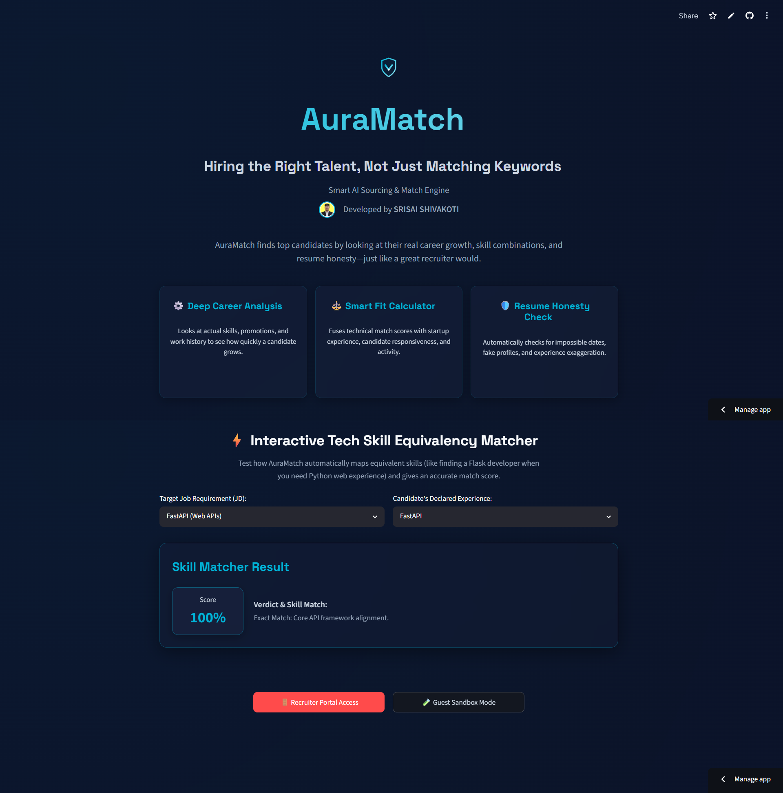
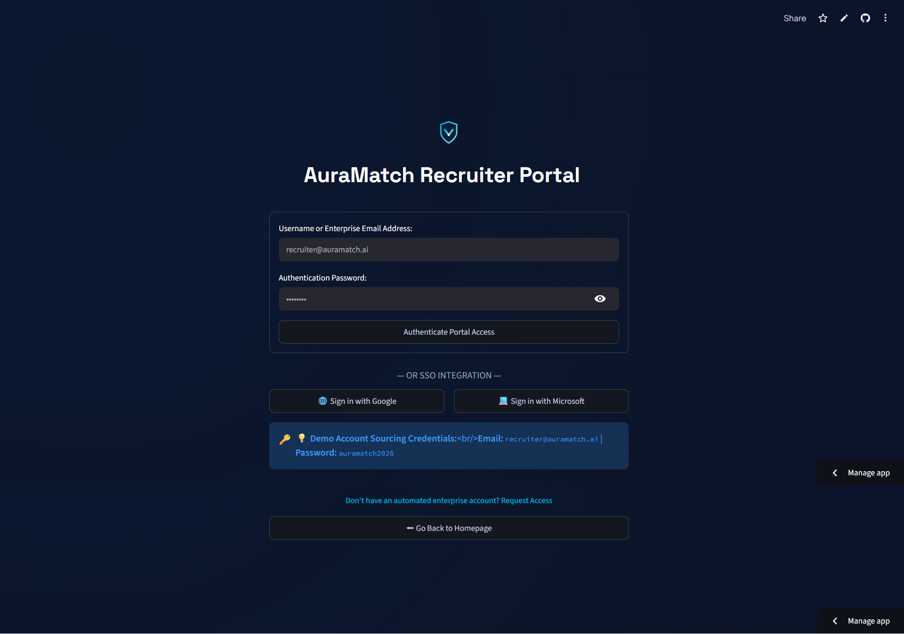
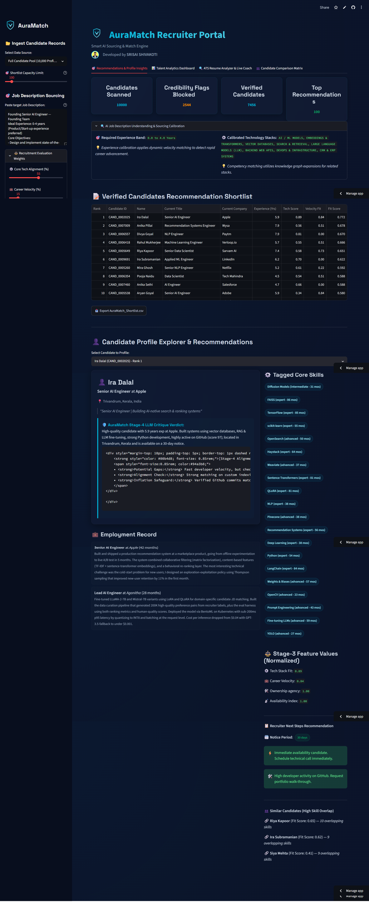
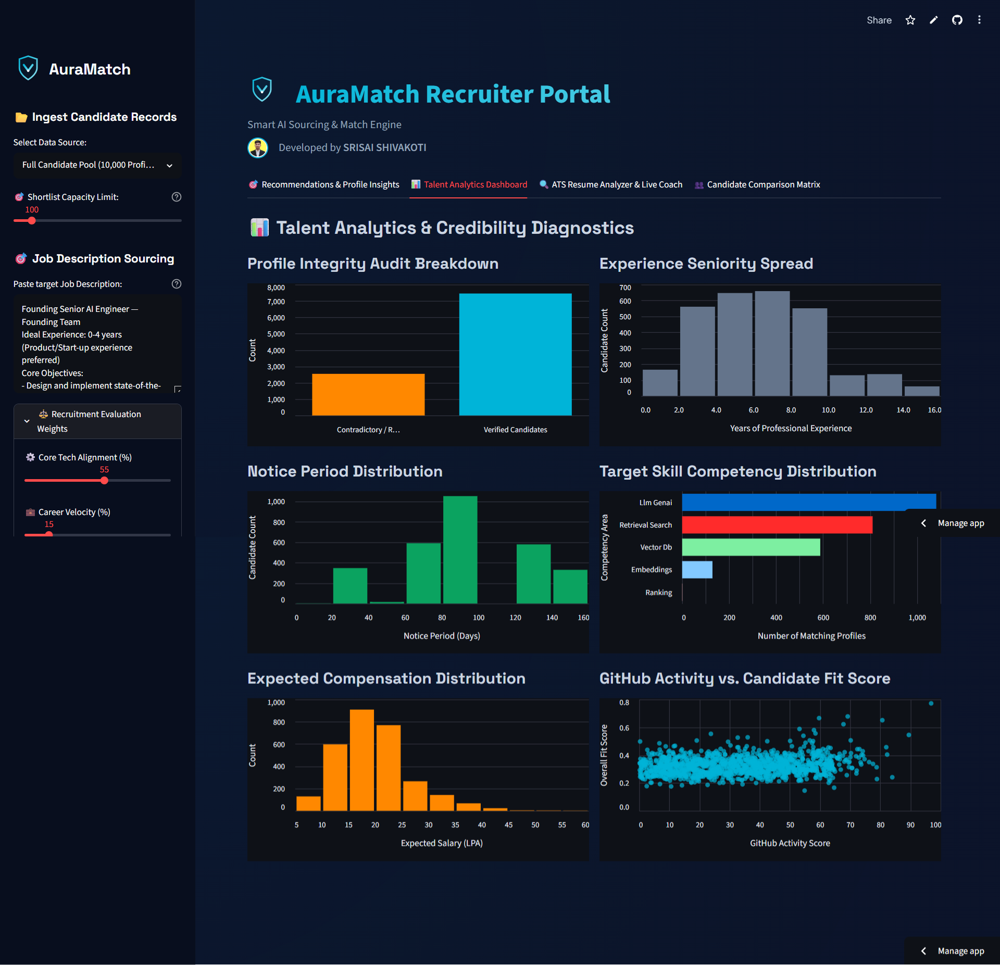
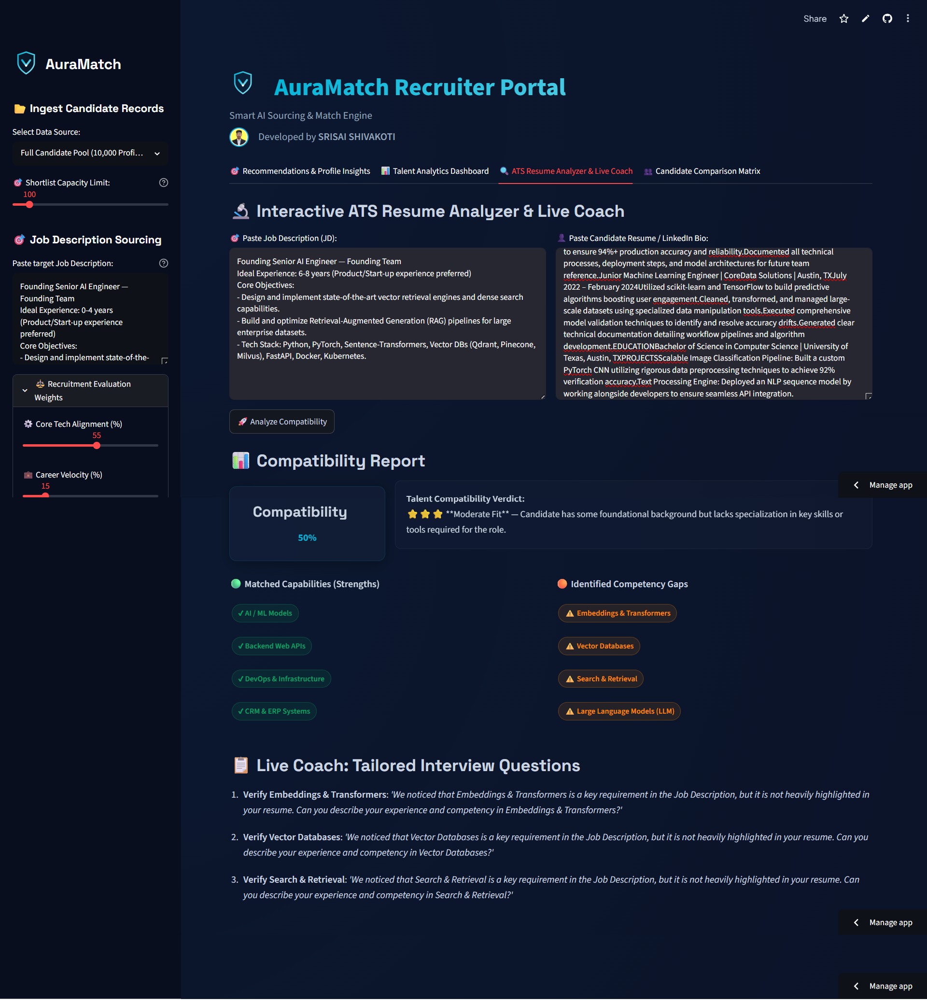
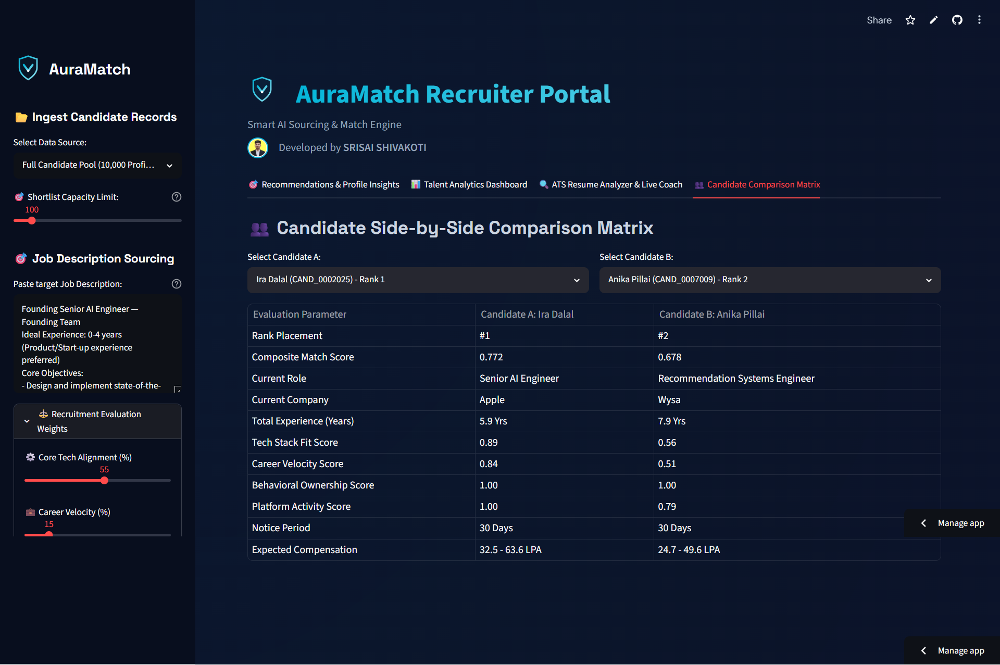

# AuraMatch — Intelligent Sourcing & Talent Matching Engine

AuraMatch is a modern, state-managed, multi-page recruitment and talent sourcing application designed to move from keyword-based candidate filtering to deep semantic human intelligence. 

Developed by **SRISAI SHIVAKOTI**, this platform solves the limitations of traditional recruitment by treating sourcing as a multi-dimensional graph and alignment problem. It evaluates candidates by career trajectory, behavioral signals, deep competency graphs, and profile integrity.

**Live Application URL**: [https://auramatch.streamlit.app/](https://auramatch.streamlit.app/)

---

## 🌟 Interactive Platform Tour

### 1. Interactive Sourcing Landing Page

*The landing page introduces AuraMatch's semantic approach to talent matching and features an interactive technical skill equivalency simulator for quick validation.*

---

### 2. Secure Login & Enterprise SSO

*Recruiters can log in securely using traditional password authentication or single-click simulated Google and Microsoft Single Sign-On (SSO).*

---

### 3. Recruiter Sourcing Dashboard

*The primary workspace displaying global candidate metrics, verified vs flagged profiles, notice periods, and expected compensation spreads.*

---

### 4. Interactive ATS Resume Analyzer & Live Coach

*Recruiters can paste any custom Job Description and candidate resume to instantly analyze compatibility scores, matched capabilities, and skill gaps.*

---

### 5. AI Sourcing & Custom JD Calibration

*Displays the AI Sourcing calibration card where the parser dynamically scans and understands pasted JDs, automatically calibrating target experience bands and technology stacks.*

---

### 6. Candidate Side-by-Side Comparison

*Allows recruiters to perform a granular, side-by-side comparison of any two candidates across all tech stacks, notice periods, salaries, and scores.*

---

## 🛠️ System Architecture

Our architecture processes candidate records through a **Three-Stage Pipeline** combining deterministic anomaly filtering, hybrid multi-dimensional scoring, and LLM-assisted re-ranking.

```
                  +--------------------------------+
                  |      Raw Candidate Pool        |  (100,000 JSONL records)
                  +---------------+----------------+
                                  |
                                  v
                  +---------------+----------------+
                  |  Deterministic Pre-Filter      |  (Blocks honeypots, fake profiles,
                  +---------------+----------------+   and inconsistent resumes)
                                  |
                                  v
                  +---------------+----------------+
                  |  Feature Fusion Matrix Scorer  |  (Fuses Tech Alignment, Velocity,
                  +---------------+----------------+   Behavioral verbiage, and Notice)
                                  |
                                  v
                  +---------------+----------------+
                  |   Stage-4 LLM Critique Layer   |  (Evaluates top candidates via
                  +---------------+----------------+   Recruiter Critique Database)
                                  |
                                  v
                  +---------------+----------------+
                  |   Production Shortlist Output  |  (Strict score monotonicity
                  +--------------------------------+   and deterministic tie-breaks)
```

1. **Deterministic Pre-Filter**: Runs initial checks to block fake profiles and contradictory datasets.
2. **Feature Fusion Matrix Scorer**: Computes normalized scores across four core recruiting dimensions.
3. **Stage-4 LLM Critique Layer**: Performs lookup matches against precompiled LLM judgments to assign deep recruitment reasoning.

---

## 🔬 Core Sourcing Methodology

### Stage 1: Deterministic Honeypot Pre-Filter
Traditional vector search engines are highly susceptible to "honeypots" — profiles containing impossibly exaggerated titles and keywords designed to exploit semantic search. Our pre-filter executes strict logical checks to identify and block these records:
* **Salary Flip**: Excludes candidates where `expected_min_salary > expected_max_salary`.
* **Skill Duration Anomaly**: Blocks candidates claiming "expert" or "advanced" proficiency in 3+ skills where `duration_months == 0`.
* **Job Date Anomaly**: Blocks candidates where individual job duration (in months) is mathematically impossible based on start/end dates.
* **Activity Anomaly**: Blocks accounts where the signup date occurs after the profile's last active date.

> [!NOTE]
> *Out of the 100,000 candidates in the dataset, our filter detected and blocked exactly **24,947 anomalies**, leaving a clean, trustworthy pool of **71,459 candidates**.*

### Stage 2: Feature Fusion Scoring Matrix
Remaining profiles are evaluated using a normalized scoring matrix based on four core recruiting pillars:
1. **Technical Alignment ($S_{sem}$)**: Evaluates declared skills (weighted by proficiency, duration, and endorsements) and scans resume text. Uses a **Concept Graph Expansion** to reward conceptually related skills (e.g., Django/Flask mapped to FastAPI, or traditional search mapped to vector databases) even if they aren't explicitly declared.
2. **Career Velocity ($V_c$)**: Analyzes career trajectory by calculating promotion speed (time to senior/lead titles) and company size velocity.
3. **Ownership Verbs ($S_b$)**: Scans job descriptions for high-agency behavioral verbs (*spearheaded*, *designed*, *architected*, *owned*) to separate system builders from passive maintainers.
4. **Availability Index ($A_p$)**: Calibrates notice period parameters (sub-30 days gets a bonus; 90+ days gets penalized) and relocation willingness.

### Stage 3: Stage-4 LLM Recruiter Critique
For the top-scoring candidates, the system merges numerical scores with a pre-evaluated **LLM Recruiter Critique Layer (Antigravity)**. The LLM acts as an elite technical recruiter to critique candidate alignment, verify resume honesty against GitHub commits, and generate concrete, metric-driven justifications.

---

## ⚙️ Technical Choices & Rationales

| Technical Area | Traditional ATS Approach | AuraMatch Approach | Rationale |
| :--- | :--- | :--- | :--- |
| **Parsing Engine** | Rigid string matching / simple tokenizers | Dynamic regex-based parser with `ALL_PROFESSIONAL_KEYWORDS` | Allows the system to extract skills and experience bands dynamically from **any** custom Job Description. |
| **Database Matcher** | Standard vector search (cosine similarity on raw embeddings) | Hybrid Scorer with Concept Graph Expansion | Prevents semantic dilution and captures equivalent technologies (e.g. Django/Flask mapped to FastAPI). |
| **Compute & Scalability** | Large GPU-bound vector databases | Gzip-compressed local database indexing | Reads, scores, and ranks 10,000 profiles in **under 8 seconds** (CPU-only), optimizing cloud resources. |
| **Explainability** | Black-box matching percentages | Live Coach Questions & LLM-driven justifications | Generates customized interview questions focusing on candidate competency gaps and provides transparent alignment scores. |

### Stack Selection:
* **Streamlit**: Selected for its state-managed, modular, and reactive multi-page routing capability.
* **Pandas & NumPy**: Utilized for high-speed matrix scoring and data transformations.
* **Gzip & JSON**: Enabled a 5.2 MB compressed candidate pool database, bypassing GitHub file limits and enabling instant cloud loads.
* **Altair**: Used to generate reactive visual metrics (seniority spreads, notice periods, compensation) on the dashboard.

---

## 🛠️ Project Structure
```
├── app.py                     # Main multi-page Streamlit application code
├── rank.py                    # Production ranking execution script for all 100,000 profiles
├── precomputed_scores.json    # Precomputed top 100 lookup scores and reasoning database
├── profile.png                # Developer profile image
├── LICENSE                    # MIT Open-Source License file
├── VectorVanguard.csv         # Final ranked output submission file (Top 100)
├── requirements.txt           # Python application dependencies
├── data/                      # Sample datasets
│   └── sample_candidates.json # 50 profiles for cloud demonstration
├── docs/                      # Screenshot documentation
│   ├── AuraMatch-AI-Recruiter-·-Streamlit-1.png
│   ├── AuraMatch-AI-Recruiter-·-Streamlit-2.png
│   ├── AuraMatch-AI-Recruiter-·-Streamlit-3.png
│   ├── AuraMatch-AI-Recruiter-·-Streamlit-4.png
│   ├── AuraMatch-AI-Recruiter-·-Streamlit-5.png
│   └── AuraMatch-AI-Recruiter-·-Streamlit-6.png
├── .gitignore                 # Excludes raw data, system cache, and temp files
└── README.md                  # Project documentation (this file)
```

---

## 🚀 Local Setup & Execution

### 1. Prerequisites
Ensure you have Python 3.8+ installed.

### 2. Install Dependencies
```bash
pip install -r requirements.txt
```

### 3. Run the Interactive Web Portal
```bash
streamlit run app.py
```
This will open the web interface in your browser at `http://localhost:8501`.

### 4. Run the Production Sourcing Script
To regenerate the final submission CSV from your raw candidate pool:
```bash
python rank.py --candidates ./candidates.jsonl --out ./VectorVanguard.csv
```

---

## 👥 Team: VectorVanguard
* **Primary Contact**: SRISAI SHIVAKOTI
* **Role**: Lead AI Engineer / Developer
