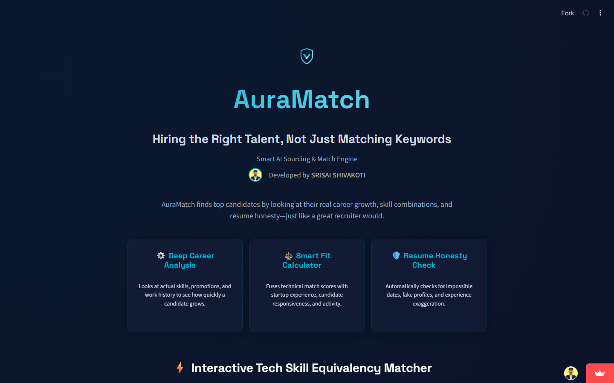
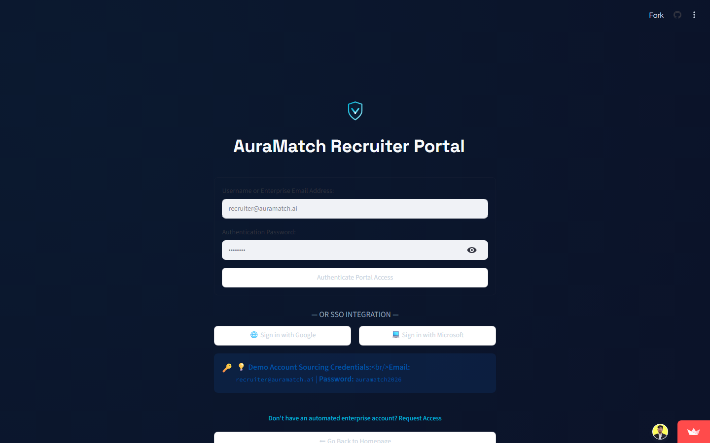
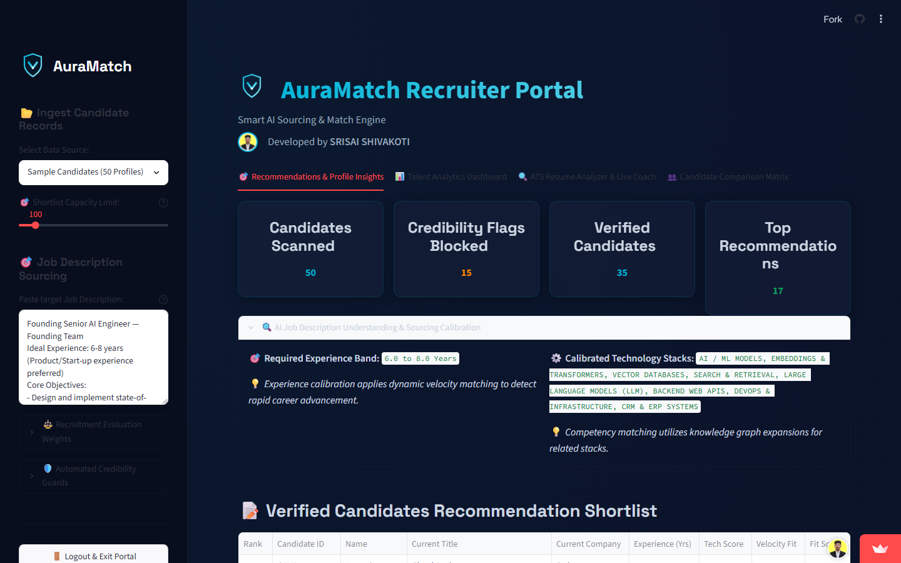
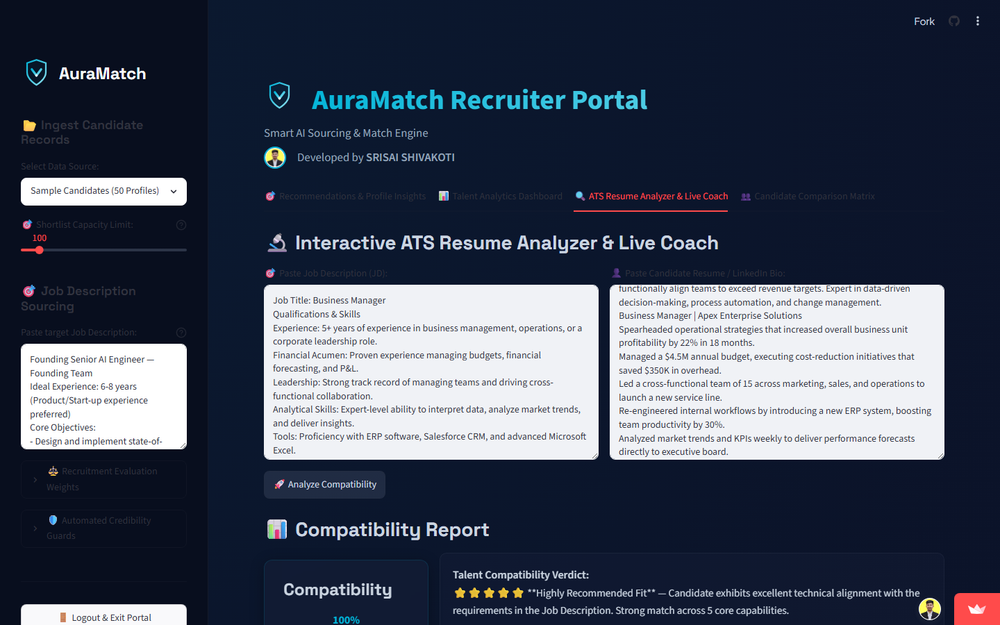

# AuraMatch — Intelligent Sourcing & Talent Matching Engine

AuraMatch is a modern, state-managed, multi-page recruitment and talent sourcing application designed to move from keyword-based candidate filtering to deep semantic human intelligence. 

Developed by **SRISAI SHIVAKOTI**, this platform solves the limitations of traditional recruitment by treating sourcing as a multi-dimensional graph and alignment problem. It evaluates candidates by career trajectory, behavioral signals, deep competency graphs, and profile integrity.

**Live Application URL**: [https://auramatch.streamlit.app/](https://auramatch.streamlit.app/)

---

## 🌟 Interactive Platform Tour

### 1. Interactive Landing Page
* **Recruiter-Friendly Value Propositions**: Explains how AuraMatch performs deep career velocity analysis, smart fit calculation, and resume honesty checks in clear, simple language.
* **Live Tech Skill Simulator**: An interactive playground where recruiters can map equivalent tech skills (e.g. mapping Django/Flask to FastAPI, or traditional search to modern vector search) and see compatibility scores and verdicts dynamically.



---

### 2. Recruiter Portal Login & SSO
* **Secure Portal Simulator**: Recruiters can log in with demo credentials (`recruiter@auramatch.ai` / `auramatch2026`).
* **Functional SSO buttons**: Supports single-click authentication via simulated Google and Microsoft OAuth buttons.



---

### 3. Recruiter Sourcing Dashboard
* **Dynamic Job Description (JD) Calibration**: Pasting any Job Description automatically scans it using a comprehensive professional keyword dictionary (`ALL_PROFESSIONAL_KEYWORDS`).
* **Extracted Experience Band**: Dynamically extracts the target experience range (e.g., `5 to 8 years`).
* **Calibrated Tech Stacks**: Identifies target technology requirements and updates candidate fit scores instantly.
* **AI Calibration Expander**: Displays a clear summary of the AI's understanding of the role at the top of the dashboard.
* **Candidate List & Metrics**: Renders visual statistics on verified vs blocked candidates, notice periods, and expected compensation.



---

### 4. Interactive ATS Resume Analyzer & Live Coach
* **Universal Candidate Matching**: Paste any JD and any candidate resume (such as the included Business Manager sample) to calculate match percentages.
* **Dynamic Verdicts**: Generates structured fit verdicts based on the candidate's matched capabilities.
* **Live Interview Coach**: Dynamically generates tailored, context-specific interview questions focused on the candidate's exact competency gaps.



---

## 🛠️ Project Structure
```
├── app.py                     # Main multi-page Streamlit application code
├── rank.py                    # Production ranking execution script for all 100,000 profiles
├── precomputed_scores.json    # Precomputed top 100 lookup scores and reasoning database
├── profile.png                # Developer profile image
├── VectorVanguard.csv         # Final ranked output submission file (Top 100)
├── requirements.txt           # Python application dependencies
├── data/                      # Sample datasets
│   └── sample_candidates.json # 50 profiles for cloud demonstration
├── docs/                      # Screenshot documentation
│   ├── landing_page.png
│   ├── login_page.png
│   ├── recruiter_portal_dashboard.png
│   └── ats_resume_analyzer.png
├── .gitignore                 # Excludes raw data, system cache, and temp files
└── README.md                  # Project documentation (this file)
```

---

## 🚀 Local Setup & Execution

### 1. Prerequisites
Ensure you have Python 3.8+ installed.

### 2. Install Dependencies
```bash
pip install -r requirements.txt
```

### 3. Run the Interactive Web Portal
```bash
streamlit run app.py
```
This will open the web interface in your browser at `http://localhost:8501`.

### 4. Run the Production Sourcing Script
To regenerate the final submission CSV from your raw candidate pool:
```bash
python rank.py --candidates ./candidates.jsonl --out ./VectorVanguard.csv
```

---

## 👥 Team: VectorVanguard
* **Primary Contact**: SRISAI SHIVAKOTI
* **Role**: Lead AI Engineer / Developer
